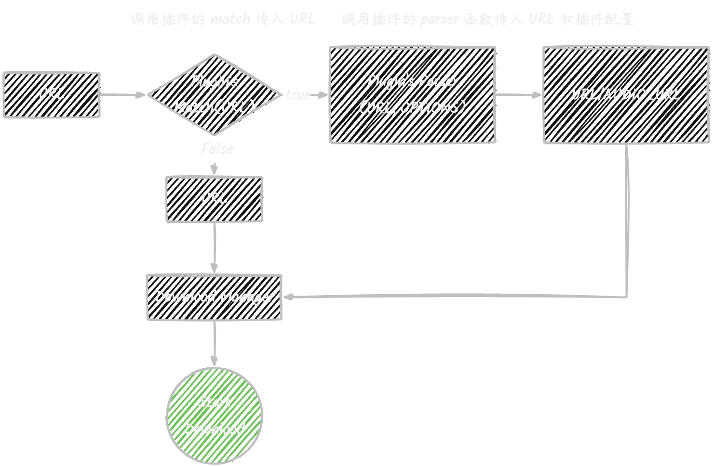

# FFandown Plugin

<p>Firstly, you need to know that this is a demo specifically designed for developing plugins for ffandown. It does not support other systems</p>

<p><a href="/README_ZH.md">
        
</a><a href="https://github.com/helson-lin/ffandown-plugin">
       
</a></p>


## Requirements

- FFandown
- Node 18+

## Development

The plugin is called before downloading. The address entered in ffandown will first enter the plugin system for matching (passing). If the plugin is matched, the address and plugin configuration information will be passed to the plugin's parser method. After the parser returns the resolved address, the ffadown downloader will be called to start downloading.




### Basic Plugin

The basic structure of a plugin is as follows:

```javascript
class Parser {
    match(url) {
        // Return true if the URL matches
        return true;
    }
    async parser(url, options) {
        return {
            url,
            audioUrl,
            headers: [
                {
                    key: 'cookie',
                    value: 'cookie'
                }
            ]
        }
    }
}
```

A plugin is a class, and both the `match` and `parser` methods must be implemented.
- The `match` method is used for URL matching.
- Returning `true` from the `match` method indicates a successful match, and the `parser` method returns the parsed URL.
- The `match` method takes a URL as its parameter.

The `parser` method is used to parse the URL and must return an object with the following structure:
```javascript
{
    url: string,
    audioUrl: string,
    headers: [{
        key: string,
        value: string
    }]
}
```
- `url` is the video URL, and `audioUrl` is the audio URL. (Note: `audioUrl` is optional)
- If both `url` and `audioUrl` are present, both video and audio will be downloaded and merged.
- `headers` is an optional array of request headers, where each element is an object.

The `parser` method receives the URL and plugin configuration as parameters.
Plugin configuration is set within the plugin system and will be passed to the plugin's `parser` method.

### Plugin Configuration

If the plugin requires configuration (e.g., for cookies), it must first be configured in the `settings` field of `package.json`.

The structure of the `settings` field is as follows:

```json
{
    "settings": {
        "cookie": {
            "type": "input",
            "value": "",
            "require": true,
            "label": "Cookie"
        },
        "quality": {
            "type": "select",
            "options": [
                {
                    "label": "8K Ultra HD",
                    "value": "127"
                },
                {
                    "label": "Dolby Vision",
                    "value": "126"
                },
                {
                    "label": "True Color HDR",
                    "value": "125"
                },
                {
                    "label": "4K Ultra HD",
                    "value": "120"
                },
                {
                    "label": "1080P 60FPS HD",
                    "value": "116"
                },
                {
                    "label": "1080P+",
                    "value": "112"
                },
                {
                    "label": "1080P HD",
                    "value": "80"
                },
                {
                    "label": "720P 60FPS HD",
                    "value": "72"
                },
                {
                    "label": "720P HD",
                    "value": "64"
                },
                {
                    "label": "480P Clear",
                    "value": "32"
                },
                {
                    "label": "360P Smooth",
                    "value": "16"
                },
                {
                    "label": "240P Fast",
                    "value": "6"
                }
            ],
            "require": true,
            "label": "Max Quality",
            "value": "116"
        }
    }
}
```

Each field under the `settings` object represents a configuration item for the plugin.

For example, the current configuration includes two items: `cookie` and `quality`.
- The `cookie` configuration is an input field, with `value` as the default, `require` indicating whether it is required, and `label` as the display text.
- The `quality` configuration is a dropdown, with `options` as the dropdown choices, `require` indicating whether it is required, `label` as the display text, and `value` as the default.

The `type` field supports the following values:
- `input` for an input field
- `select` for a dropdown