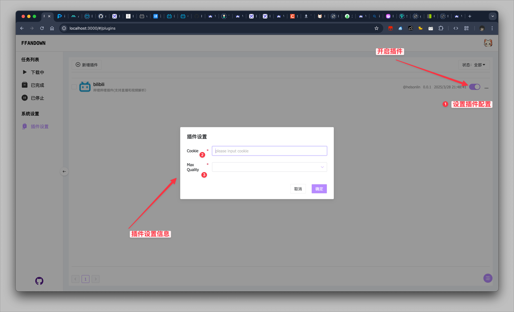

# FFandown 插件

<p>首先，你需要知道这是一个专门为开发ffandown插件的 demo。它不支持其他系统</p>

<p><a href="/README.md">
        
</a><a href="https://github.com/helson-lin/ffandown-plugin">
       
</a></p>

##  要求

- FFandown
- Node 18+


## 开发 

> 不支持在脚本内引入其他的第三方模块

插件是在下载之前调用的，在 ffandown 输入的地址，首先会进入插件系统匹配（通过插件的 match 方法匹配），如果匹配到了插件，那么会将地址和插件的配置信息传给插件的 parser 方法，等待 parser 返回解析后的地址之后，调用 ffandown 的下载器开始下载。

插件是通过 node 的 vm 模块运行的，插件不可以调用所有的 node 的模块，仅支持以下几个模块和函数。

`fs`、`path`模块只能操作 tmp（可执行文件目录） 文件夹，其他文件夹没有权限执行。

| 模块 | 模块文档 |
| ----------- | ----------- |
| bcrypt | https://www.npmjs.com/package/bcrypt ^5.1.1 |
| fetch | https://www.npmjs.com/package/node-fetch ^2 |
|  URL | https://nodejs.org/api/url.html#class-url |
|  URLSearchParams | https://nodejs.org/api/url.html#class-urlsearchparams |
|  console | https://nodejs.org/api/console.html#console |
|  fs | readFileSync、writeFileSync、existsSync、mkdirSync、readdirSync、unlinkSync、statSync、 |
|  path | https://nodejs.org/api/path.html |
|  log | winston实例，日志会输出到日志文件内，verbose 方法会在 debug 开启时输出 |


### 基础插件

插件的基础结构如下：

```js
class Parser {
    match(url) {
        // return true if the url is matched
        return true;
    }
    async parser(url, options) {
        return {
            url,
            audioUrl,
            headers: [
                {
                    key: 'cookie',
                    value: 'cookie'
                }
            ]
        }
    }
}
```

插件本身是一个类，match 和 parser 方法必须存在。
`match` 方法用于匹配地址，
`match` 方法返回 true 表示匹配成功，`parser` 方法返回解析后的地址。
`match` 方法的参数是地址

`parser` 方法用于解析地址，需要解析后的地址必须是一个对象，对象的结构如下：
```js
{
    url: string,
    audioUrl: string,
    headers: [{
        key: string,
        value: string
    }]
}
```
url 是视频的地址，audioUrl 是音频的地址。(注意：audioUrl 是可选的)
如果 url 和 audioUrl 同时存在，那么会同时下载视频和音频并合并在一起。
`headers` 是请求头，是一个数组，数组的每个元素是一个对象。
`headers` 是可选的。

`parser` 方法的参数是地址和插件的配置信息。
插件的配置信息是在插件系统内配置，在插件系统内配置的插件的配置信息会被传递给插件的 parser 方法。

### 插件配置

如果插件需要配置 cookie 等信息，那么首先需要在`package.json`中的 `settings`字段内配置。

`settings` 字段的结构如下：

```json
{
     "settings": {
        "cookie": {
            "type": "input",
            "value": "",
            "require": true,
            "label": "Cookie",
            "placeholder": "请输入 cookie"
        },
        "quality": {
            "type": "select",
            "placeholder": "请选择最高质量",
            "options": [
                {
                "label": "超高清 8K",
                "value": "127"
                },
                {
                "label": "杜比视界",
                "value": "126"
                },
                {
                "label": "真彩 HDR",
                "value": "125"
                },
                {
                "label": "超清 4K",
                "value": "120"
                },
                {
                "label": "高清 1080P60",
                "value": "116"
                },
                {
                "label": "高清 1080P+",
                "value": "112"
                },
                {
                "label": "高清 1080P",
                "value": "80"
                },
                {
                "label": "高清 720P60",
                "value": "72"
                },
                {
                "label": "高清 720P",
                "value": "64"
                },
                {
                "label": "清晰 480P",
                "value": "32"
                },
                {
                "label": "流畅 360P",
                "value": "16"
                },
                {
                "label": "极速 240P",
                "value": "6"
                }
            ],
            "require": true,
            "label": "Max Quality",
            "value": "116"
        }
  }
}
```

`settings`对象下面的每个字段都是一个插件的配置项。

例如当前的配置内，有两个配置项，一个是 cookie，一个是 quality。
cookie 的配置项是一个输入框，value 是默认值，require 是是否必填，label 是标签。
quality 的配置项是一个下拉框，options 是下拉框的选项，require 是是否必填，label 是标签，value 是默认值。

`type` 字段的值支持以下几种：
- `input` 输入框
- `select` 下拉框


### 测试

#### 测试插件

1. 修改`parser.test.js`内测试的地址为插件解析的平台地址。

2. `npm run test`确保测试用例通过。

#### 新增插件

在开发插件时，你可以使用 `npm run dev` 命令来启动插件。
在启动插件后，你可以在 FFandown 内的插件系统内新增插件，在插件内输入地址： `http://loclahost:3312`。

#### 配置插件信息




## 打包

`npm run build` 打包插件，打包后的插件在 `build` 文件夹内, 打包后的插件可以上传到在线 oss 服务或者利用 github 的 workflows 打包到 Release,目前该项目已经支持 github actions 自动打包，只需推送对应版本的 tag 即可自动构建。
